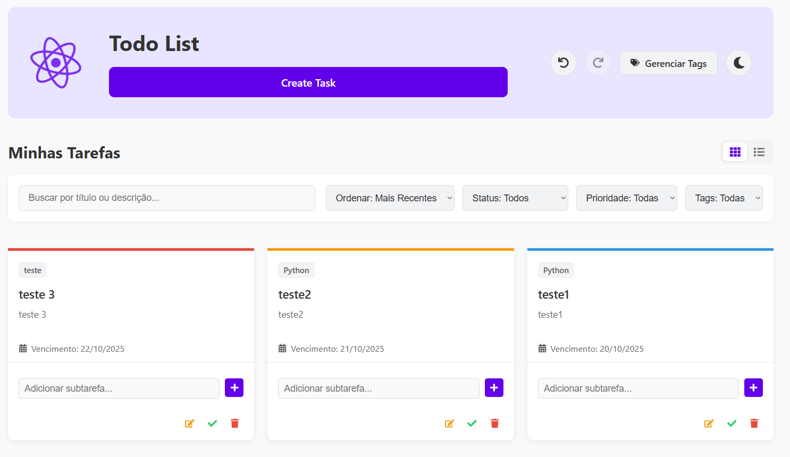
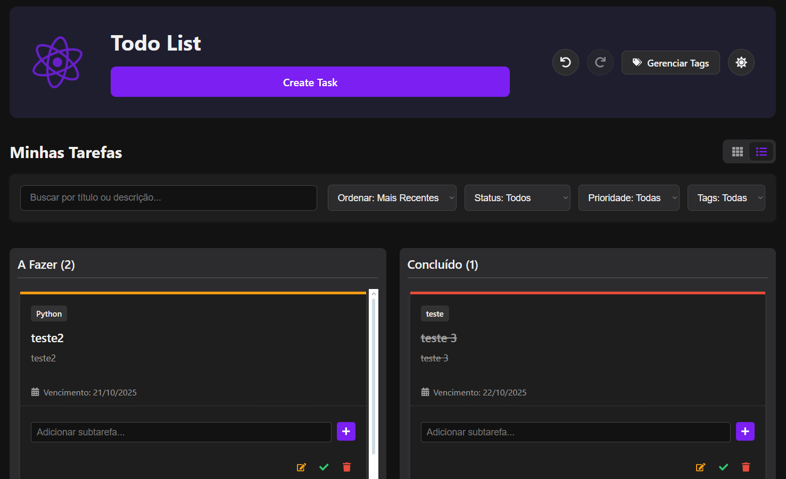
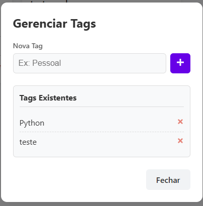
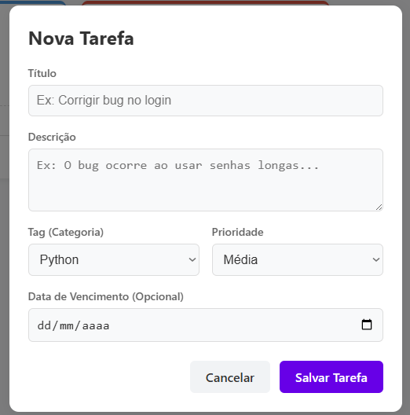

# Projeto To-Do List (Teste Técnico React )

Uma aplicação moderna de lista de tarefas desenvolvida em React.js com TypeScript, como parte de um teste técnico. O projeto demonstra domínio em componentização, gerenciamento de estado avançado (Hooks e Context), persistência local e testes automatizados.

## ✨ Features Implementadas

Este projeto vai além do CRUD básico, implementando todos os requisitos funcionais, de avaliação e bônus:

* [cite_start]**CRUD de Tarefas:** Criar, Editar (inline), Remover e Marcar como Concluída.
* [cite_start]**CRUD de Tags:** Um gerenciador de tags global permite adicionar ou remover categorias[cite: 26], garantindo que não haja tags duplicadas ou com erros de digitação.
* [cite_start]**Filtros Avançados:** Filtre tarefas por Status (pendente/concluída), Prioridade e Tags[cite: 29].
* [cite_start]**Busca Textual:** Busque tarefas em tempo real pelo título ou descrição[cite: 30].
* [cite_start]**Ordenação:** Reordene a lista por data de criação, data de vencimento ou prioridade[cite: 31].
* [cite_start]**Persistência Dupla:** O estado das tarefas e a lista mestre de tags são salvos no `localStorage`.
* [cite_start]**Tema Claro/Escuro (Bônus):** Suporte completo a Dark Mode, com a preferência do usuário salva localmente.
* [cite_start]**Formulário Inteligente:** O formulário de criação impede a seleção de datas de vencimento no passado e valida os campos com feedbacks de erro[cite: 33].
* [cite_start]**Testes Automatizados (Bônus):** Testes unitários no hook `useTodos` usando Vitest e React Testing Library (RTL)[cite: 39, 61].
* [cite_start]**Acessibilidade (AA):** A aplicação é totalmente acessível, com `aria-labels` em todos os botões e inputs[cite: 34, 59].
* [cite_start]**Responsividade:** O layout se adapta perfeitamente a dispositivos mobile e desktop.

## 🚀 Como Rodar o Projeto

Siga os passos abaixo para executar a aplicação em modo de desenvolvimento.

1.  Clone este repositório:
    ```bash
    git clone [SEU_LINK_DO_GITHUB_AQUI]
    ```
2.  Navegue até a pasta do projeto e instale as dependências:
    ```bash
    npm install
    ```
3.  Inicie o servidor de desenvolvimento (Vite):
    ```bash
    npm run dev
    ```
    A aplicação estará disponível em `http://localhost:5173`.

4.  Para rodar os testes automatizados:
    ```bash
    npm run test
    ```

## 🛠️ Principais Decisões Técnicas

* **Framework & Build:** React 18+ (com Hooks) e Vite com TypeScript para uma fundação moderna e rápida.
* **Gerenciamento de Estado:**
    * **Hook Customizado (`useTodos`):** Toda a lógica de negócio (CRUDs, filtros, ordenação) foi centralizada em um único hook, desacoplando a lógica da UI.
    * **React Context (`ThemeContext`):** Utilizado para gerenciar o estado global do tema (claro/escuro) de forma eficiente.
* **Estilização:**
    * **CSS Modules:** Para criar estilos componentizados e evitar conflitos de nomes.
    * **CSS Variables (Variáveis CSS):** A arquitetura de cores foi 100% baseada em variáveis, permitindo a troca de tema (Dark Mode) de forma instantânea e limpa.
* [cite_start]**Persistência:** `localStorage` é usado para armazenar duas chaves: uma para a lista de tarefas e outra para a lista mestre de tags definidas.
* [cite_start]**Testes:** Vitest + React Testing Library (RTL) foram escolhidos para testar a lógica do hook `useTodos` (o "cérebro" da aplicação) de forma isolada e eficaz.


## 📸 Screenshots## 📸 Screenshots

*(Seção reservada para prints da aplicação)*

**Tema Claro**


**Tema Escuro**


**Modais (Criação e Gerenciamento de Tags)**

